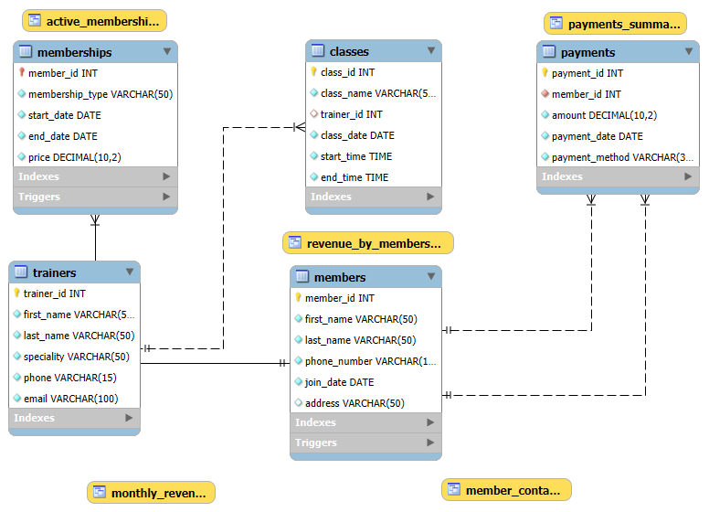

# Gym Management System (MySQL)

## Overview
A **Gym Management System** database built with **MySQL Workbench 8.0**, designed to manage gym classes, members, memberships, payments, and trainers.  
Demonstrates relational database design, data integrity, advanced queries, and stored procedures.

## Features
- 5 main tables: `classes`, `members`, `memberships`, `payments`, `trainers`  
- Primary/foreign keys, unique & check constraints  
- Stored procedures and views for automation and reporting  
- Sample data included for testing  

## Files
## Usage
1. Open **MySQL Workbench**.  
2. Import `gym_system.sql` via:  
   `Server → Data Import → Import from Self-Contained File`  
3. Run queries, views, and procedures as needed.
   
## Database Diagram



## Example Query
```sql
-- List members and active memberships
SELECT m.first_name, m.last_name, ms.membership_type, ms.start_date, ms.end_date
FROM members m
JOIN memberships ms ON m.member_id = ms.member_id;
Author DANIEL ALANDARY
## Database Diagram
## Database Diagram
